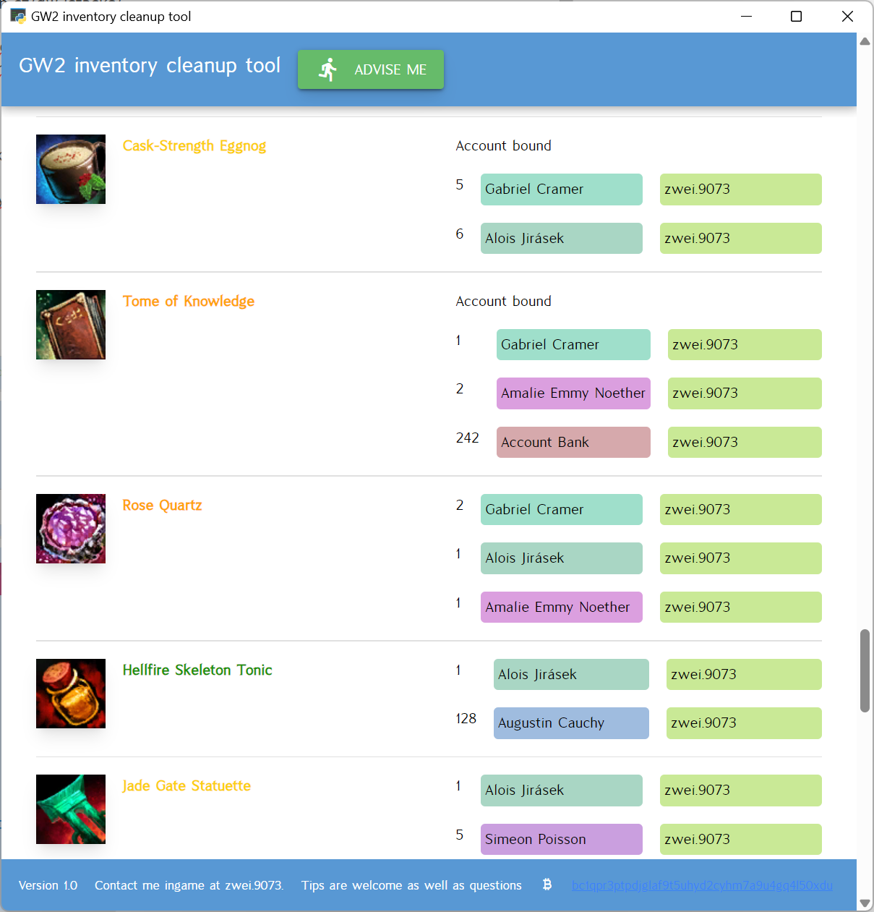
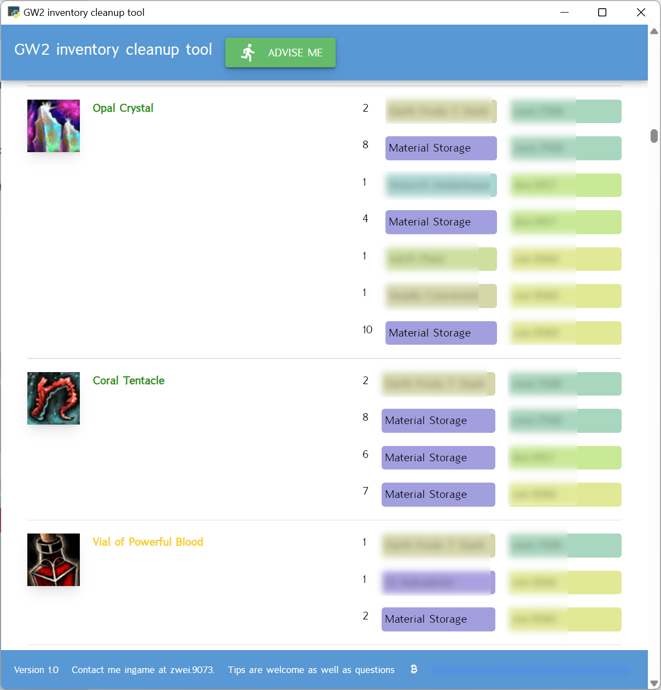

# GW2 inventory cleanup tool

This is small tool to help you to clean up your inventory.

It will try to find stack of items that can be merged. Also, items that can be discarded, used up or consumed away.

At least one item slot guaranteed! Just delete random item! Or don't.

## Some screenshots

## How to use it

1. Run this app
2. Add api key(s) for account you want to get advice on. Obtain it at [your account setting](https://account.guildwars2.com/account/api-keys). If you already have one for, for example, gw2efficiency, it will work just fine.
3. Press 'Advise me' button and wait for sections with advice to populate.

## How to get it running.

It is easy, just:

1. Get Python interpreter.
2. Install required libraries
3. Run app

### Get Python interpreter.

[Download](https://www.python.org/downloads/) latest version of Python from https://www.python.org and follow
instructions.

### Install required libraries

Run `pip3 install -r requirements.txt` command in commandline, you should be in directory where this file is.

### Run app

Run `python app.py` command, you should be in directory where this file is. Browser should open with page of this app.

## Make exe package

`nicegui-pack --copy-metadata --onefile --name "GW2 inventory cleanup tool" app.py`

## Contact

Contact me ingame at `zwei.9073`. Accepting [tips bc1qpr3ptpdjglaf9t5uhyd2cyhm7a9u4gq4l50xdu](bitcoin:bc1qpr3ptpdjglaf9t5uhyd2cyhm7a9u4gq4l50xdu)